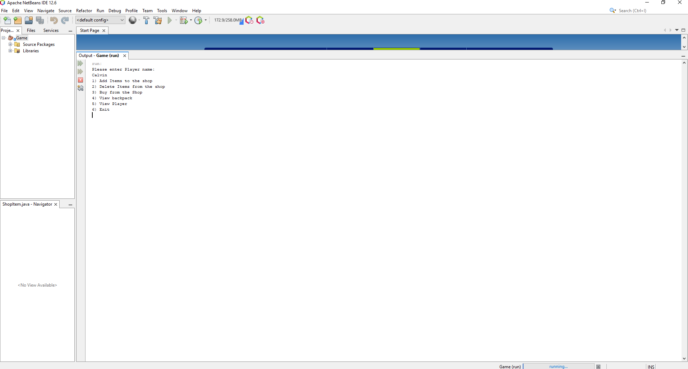
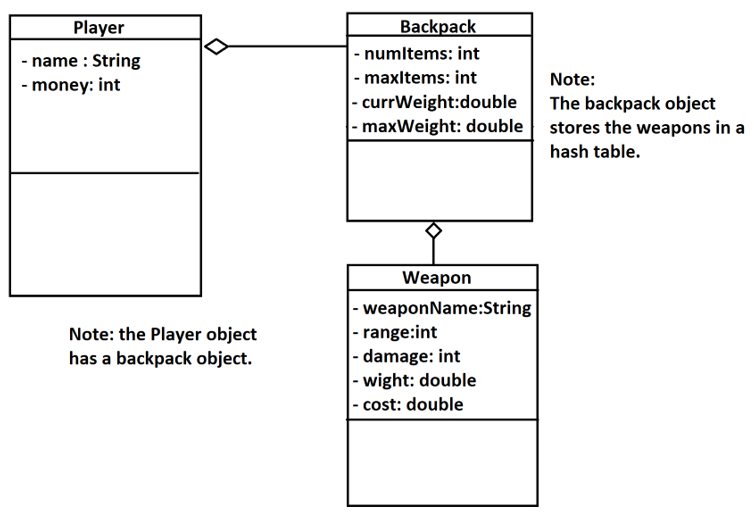

# Data_Structures_Algorithms_Project_Game
----------------------------------------

###### Description

Project is run using Apache NetBeans and programmed with Java. The project demonstrates object-oriented programming and usages 
of data structures & algorithm concepts such as linked listed and hash tables through a text-based shop menu. A player object is created 
which can purchase items from a shop, these items are placed in the playher's backpack using a hash table with seperate chaining while 
items which are added to the shop are stored in a hash table which implements quadratic probing.

----------------------------------------

###### Installation & Run Guide

* Install Apache NetBeans ( Version tested was Apache NetBeans IDE 12.6 )

* Clone repository

* Open project in Apache NetBeans

* Build and run project

----------------------------------------

----------------------------------------

###### Operations

* Ask for player name and create player object

* show menu with options

	* 1) Add items to the shop

	* 2) Delete items from the shop

	* 3) Buy from the shop

	* 4) View backpack

	* 5) View player

	* 6) Exit

* Validation of items added to the shop

	* if an item with the same name exists, ask for a quantity to add to current stock

	* if it does not exist, create a new item, ask for quantity, and add the item to the hash table